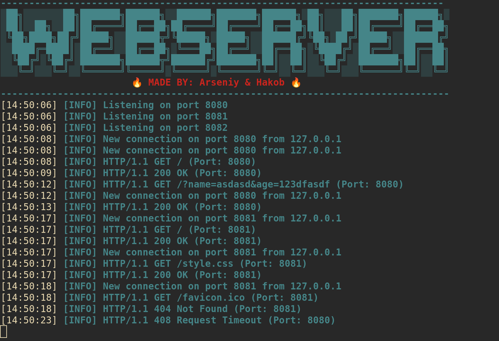

# webserv

> A shell webserver built at [42](https://42.fr) by [azolotar](https://github.com/sjapi) and [haaghaja](https://github.com/106c13)



## 📌 Description

The **webserv** project consists of building a fully functional HTTP server in **C++ (C++98)**.

The goal of this project is to understand how web servers work internally by implementing core features such as:
- Handling HTTP requests and responses
- Managing multiple client connections
- Serving static content
- Executing CGI scripts

This project emphasizes low-level programming concepts including **sockets**, **event-driven architecture**, and efficient I/O handling using **epoll**.

---

## ⚙️ Instructions

### 📦 Requirements

- C++ compiler supporting the **C++98 standard**
- Make

---

### 🔧 Compilation

```bash
make
```

---

### 🔧 Execution
```
./webserv [config file]
```

## 📚 Resources

### 📖 Documentation

- RFC 7230 — HTTP/1.1 Message Syntax and Routing  
- Beej's Guide to Network Programming  
- Linux manual pages (`man socket`, `man epoll`)  
- Nginx documentation  

---

### 🤖 AI Usage

AI tools (such as ChatGPT) were used for:

- Understanding HTTP protocol behavior and edge cases  
- Debugging issues related to sockets and epoll  
- Clarifying concepts like CGI execution and non-blocking I/O  

All core implementation, architecture design, and debugging were done manually.

## 🧾 Configuration File Structure

The configuration file is inspired by Nginx and is used to define multiple servers, routes, and their behavior. It is composed of **server blocks** and **location blocks**, each controlling different levels of request handling.

---

### 📌 Server Block

A `server {}` block defines a virtual server instance. Each server listens on a specific port and can handle multiple domains.

#### Example:
```conf
server {
    listen 8080;
    server_name localhost mysite.com;
    root pages/php_test;
    error_page 404 404.html;
	
	cgi {
		.php /usr/bin/php-cgi;
	}
}
